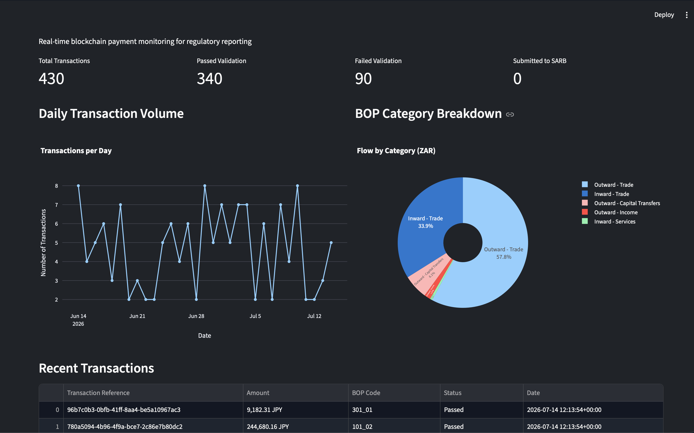

# SARB FinSurv Blockchain Compliance Pipeline

> Automated cross-border payment reporting for South African banks — from raw SWIFT data to SARB submission, validated and monitored in real time.

---

## Dashboard



---

## Why this exists

South African banks are legally required to report every cross-border payment to the South African Reserve Bank's Financial Surveillance (FinSurv) department **within 24 hours** of settlement. Manual reporting breaks under volume — transactions slip through, BOP category codes get misclassified, and the R1 000 000 individual annual allowance is easy to breach without automated tracking.

This pipeline eliminates that risk. It ingests SWIFT-format blockchain payment records, validates each transaction against current FinSurv rules, and surfaces exceptions before the reporting window closes.

---

## What it does

| Stage | What happens |
|---|---|
| **Generate** | Synthetic SWIFT payment records with realistic wallet addresses, currencies, and BOP categories |
| **Validate** | Each transaction is checked against SARB rules — annual allowance limits, currency eligibility, BOP category codes |
| **Store** | Results written to PostgreSQL with `PASSED` / `FAILED` status and failure reason |
| **Monitor** | Streamlit dashboard shows pass rates, breach patterns, and currency exposure in real time |
| **Schedule** | Airflow DAG runs daily, aligning with the 24-hour FinSurv reporting cycle |

---

## Architecture

```
SWIFT Payment Data
       │
       ▼
┌─────────────────────┐
│  generate_          │  Python — realistic wallet addresses,
│  transactions.py    │  5 currencies, 8 BOP categories
└────────┬────────────┘
         │
         ▼
┌─────────────────────┐
│  Validation Engine  │  R1M annual allowance checks,
│                     │  currency rules, BOP code mapping
└────────┬────────────┘
         │
         ▼
┌─────────────────────┐
│  PostgreSQL 15      │  Transactions + validation results
│  (Docker)           │  PASSED / FAILED / failure_reason
└────────┬────────────┘
         │
         ▼
┌─────────────────────┐     ┌─────────────────────┐
│  Streamlit          │     │  Apache Airflow      │
│  Dashboard          │     │  (daily DAG)         │
└─────────────────────┘     └─────────────────────┘
```

---

## Current dataset

- **430+** historical transactions loaded
- **79%** compliance pass rate
- **5** currencies tracked (ZAR, USD, EUR, GBP, CNY)
- **8** BOP categories covering the most common cross-border payment types

---

## Tech stack

| Layer | Tool |
|---|---|
| Containerisation | Docker & Docker Compose |
| Database | PostgreSQL 15 |
| Data generation & validation | Python 3.9+ |
| Orchestration | Apache Airflow |
| Dashboard | Streamlit + Plotly |

---

## Quick start

**Prerequisites:** Docker, Python 3.9+

```bash
# 1. Start the database
docker-compose up -d

# 2. Generate transaction data
python scripts/generate_transactions.py

# 3. Launch the dashboard
streamlit run dashboard_app.py
```

The dashboard will be available at `http://localhost:8501`.

---

## Compliance rules implemented

- **Annual Discretionary Allowance (ADA):** Individuals may not transfer more than R1 000 000 offshore per calendar year without SARB approval. Transactions that push a sender over this threshold are flagged `FAILED`.
- **BOP category validation:** Each transaction must carry a valid Balance of Payments category code. Unrecognised or mismatched codes are rejected.
- **Currency eligibility:** Only SARB-approved currencies are accepted for FinSurv reporting.

> **Note:** This pipeline implements common FinSurv validation rules for demonstration purposes. Production deployments should be reviewed against the current SARB Exchange Control Manual.

---

## Project context

This project is part of **Project ZAR** — a broader banking compliance platform built to demonstrate end-to-end data engineering on financial regulatory workloads.

Related work: ArtBurst (serverless auction platform) · NBA Data Lake 

---

## Roadmap

- [ ] SARB FinSurv API integration for direct submission
- [ ] Real-time SWIFT message ingestion via Kafka
- [ ] Expanded BOP category coverage
- [ ] Email/Slack alerts on compliance threshold breaches
- [ ] Audit log for regulatory review